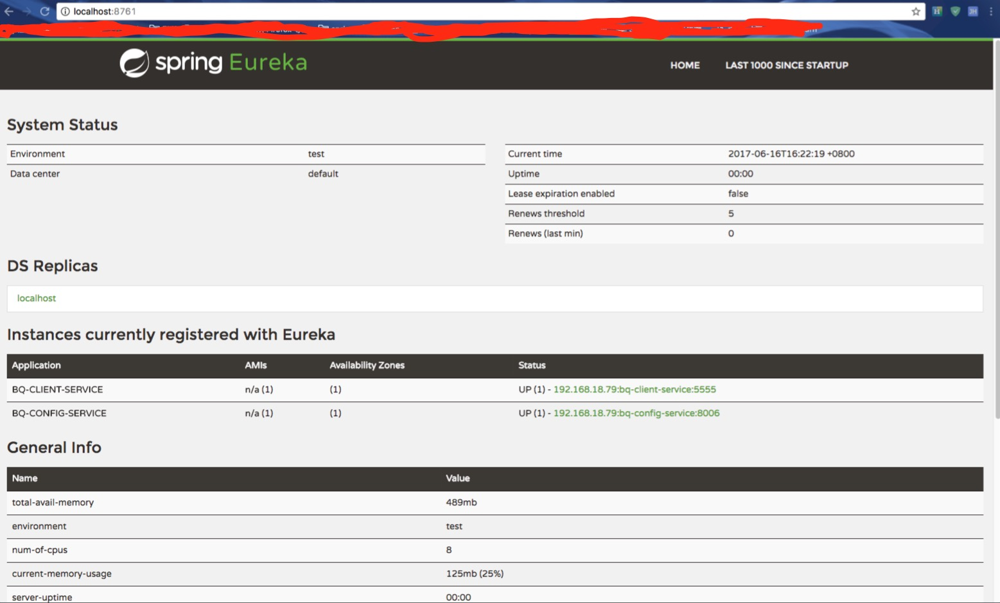

# spring-cloud
本项目为个人学习项目，后期会进行相关更新，提供微服务解决方案。
***
## 启动顺序
1. 启动浮现服务器 **bq-discovery-service**：***BqDiscoveryApplication***
2. 启动配置服务器 **bq-config-service**：***BqConfigApplication***
3. 启动负载均衡服务器：**bq-feign-service/bq-feign-service**：***BqFeignApplication/BqRibbonApplication***
4. 启动业务服务器：**bq-client-service**：***BqClientApplication***

***
## 多个服务功能明细
### bq-discovery-service 
***功能：*** 提供服务发现功能，这里是使用的Eureka 组件进行的搭建。也可以使用zookeeper、consul等进行搭建。

### bq-config-service
***功能：*** 提供各个服务的配置信息，方便进行统一处理，通过设置还可以进行动态设置（此功能后续不上）
### bq-feign-service/bq-feign-service
***功能：*** 提供负载均衡功能，断路器功能

### bq-client-service
***功能：*** 业务处理模块